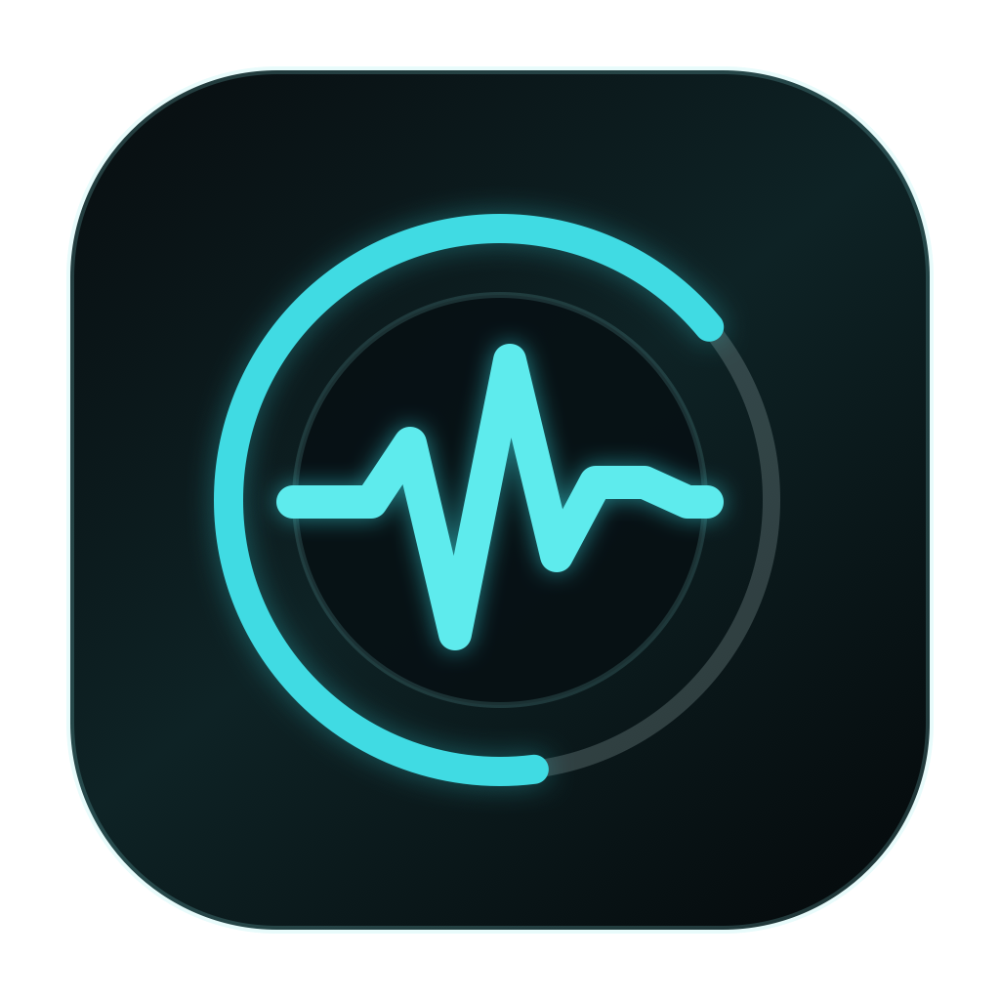

<p align="center">
  
</p>

<h1 align="center">Corewise</h1>

<p align="center">
  Understand what your Mac is doing, without giving up your data.
</p>

<p align="center">
  
  
  
  
</p>

Corewise is a local-first macOS diagnostic utility for understanding performance, storage, battery, startup activity, thermal state, and recurring app issues. It leads with observable signals, explains their limits, and never claims that one number represents the health of your Mac.

No account. No backend. No analytics. No automatic cleanup.

> [!IMPORTANT]
> Corewise is currently available as source code. The first signed and notarized public binary has not been released yet. Do not treat GitHub's automatic “Source code” archives as installable app downloads.

## What Corewise does

- **Focused Check** observes supported local signals when a Mac feels slow, hot, battery-hungry, or full, then returns a cautious explanation and one useful next step.
- **Performance** separates CPU activity, memory context, swap, and live process evidence instead of presenting duplicate rankings.
- **AI Workloads** attributes supported local tools such as Codex, Claude, Cursor, and Ollama while keeping app footprint, related local work, and shared hosts separate.
- **Storage** shows startup-volume headroom and can perform a read-only analysis after one optional Full Disk Access grant or a user-selected folder scope.
- **System diagnostics** cover safe battery basics, launch plist inventory, high-level thermal state, and user-selected crash report patterns where macOS exposes reliable data.
- **Local reports** copy a plain-language Summary or Markdown report without uploading files, stack traces, prompts, or project details.

Corewise deliberately avoids health scores, process killing, automatic deletion, private sensor APIs, hidden folder scans, and claims of exact parity with Activity Monitor.

## Install today: build from source

Requirements:

- macOS 14 Sonoma or newer
- Xcode 15 or newer, or compatible Xcode Command Line Tools
- Git

```sh
git clone https://github.com/roccodaffuso/CoreWise.git
cd CoreWise
script/build_and_run.sh
```

The script builds and signs a local development bundle at `dist/Corewise.app`, then opens it. Full Disk Access is not required to run Corewise; it is optional and used only when you explicitly start Full Storage Analysis.

For the planned signed DMG, Homebrew option, Gatekeeper requirements, and update strategy, see [Installation and distribution](docs/INSTALLATION.md).

## Privacy and safety model

Corewise reads supported diagnostics on the Mac where it is running. It has no network client, telemetry SDK, account system, payment flow, or remote database.

Every diagnostic source is classified as:

- **Live** — read from a supported local macOS source.
- **Planned** — intentionally not implemented yet.
- **Unavailable** — not currently exposed with enough reliability.
- **Avoided** — intentionally excluded for safety, privacy, or product integrity.

Storage and crash-report details require an explicit user action. Corewise does not upload diagnostic data or perform destructive remediation. Read the full [safety and privacy model](docs/SAFETY_PRIVACY.md) and [data-source matrix](docs/DATA_SOURCES.md).

## Development

Corewise is a dependency-free Swift Package Manager application targeting macOS 14+.

```sh
swift build
swift test
swift build -Xswiftc -strict-concurrency=complete -Xswiftc -warnings-as-errors
script/build_and_run.sh --verify
script/package_release.sh preview
```

The app icon is reproducible from repository-owned drawing code:

```sh
swift script/generate_app_icon.swift
```

Useful project documents:

- [Product principles](PRODUCT.md)
- [Architecture](docs/ARCHITECTURE.md)
- [Current project status](docs/PROJECT_STATUS.md)
- [Design system](docs/DESIGN_SYSTEM.md)
- [Roadmap](docs/ROADMAP.md)
- [Decision log](docs/DECISIONS.md)

## Contributing

Issues and focused pull requests are welcome while the public beta is being prepared. Please keep changes narrow, preserve the local-first and non-destructive constraints, and never attach diagnostic reports containing usernames, personal paths, process arguments, prompts, or private file contents.

Before proposing a new diagnostic, document its public macOS source, failure mode, privacy boundary, and user-facing wording.

## Project status and license

Corewise is under active beta development. The source is public for inspection and collaboration, but an open-source license has not yet been selected. Until a `LICENSE` file is added, copyright law reserves reuse and redistribution rights by default.

Selecting an OSI-approved license, freezing the permanent bundle identifier, and producing a Developer ID-signed and notarized release are explicit gates before the first public binary.
