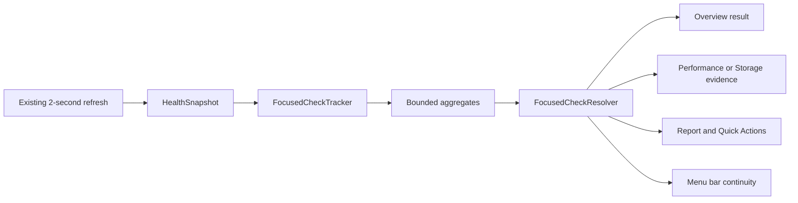

# Corewise Focused Diagnostics - Detailed Implementation Plan

Status: approved; technical implementation complete. Product interviews and the full manual accessibility/screenshot matrix remain open release-validation gates.

Implementation checkpoint: 2026-07-10

- Implemented: typed Focused Check domain, bounded tracker, refresh-gap confidence reduction, store-owned refresh lifecycle, Overview launcher/progress/result/copy flow, scan-driven Storage completion, typed deep links, three ranked check-level app groups, process persistence/interpretation, Storage coverage/attribution, reports, Quick Actions, menu bar continuity, deterministic state previews, and an English-default localization catalog.
- Verified: 111 Swift Testing tests, strict-concurrency build with warnings as errors, 225 compiled localization keys, signed app bundle, runtime result/deep-link/CPU/Memory inspection, five-minute idle/workflow CPU profiles, a 160-second release memory profile, and an explicit large Folder Scope scan.
- Performance finding: Focused Check symbols average 0.0246% of one core. Removing implicit Full Storage Analysis from normal refresh reduced the measured release physical-footprint peak from approximately 1,416 MB to 156 MB; the same peak held during an explicit scan of roughly 900,000 observed files. See `docs/PERFORMANCE_BASELINE_2026-07-10.md`.
- Not yet complete: 8-12 external trigger-based sessions, the full light/dark/size/accessibility matrix, a ten-minute Battery check on battery power, final distribution-signature profiling, and product decisions that depend on those findings.

Created: 2026-07-10

Primary input: `docs/PRODUCT_EVOLUTION_FROM_RESEARCH.md`

## 1. Outcome

Corewise should become an event-driven diagnostic assistant without losing its current precision-console depth.

The primary workflow is:

> The user notices that the Mac is slow, hot, battery-hungry, or full. Corewise observes supported local signals for an appropriate period, explains what coincided with the symptom, distinguishes persistent activity from a transient spike, and offers one safe next action.

The implementation name will be **Focused Check**. This language is calmer than “incident,” does not imply medical certainty, and fits the existing Signal System.

## 2. Assumptions

- One developer works incrementally on the current SwiftPM macOS app.
- Minimum deployment stays macOS 14.
- The current dirty worktree is preserved. No reset, broad cleanup, or unrelated refactor is part of this plan.
- `HealthDashboardStore` remains `ObservableObject`.
- `AppRouteStore` remains the small `@Observable` routing model.
- The existing two-second live refresh remains the only fast sampling loop.
- No backend, account, telemetry, network access, private API, sudo collector, process termination, or file deletion is introduced.
- Current Full Disk Access and remembered Folder Scope behavior remains the only Storage permission model.
- Focused Check history is volatile and local. It is not persisted across app launches.
- Estimates below are implementation ranges for one developer, not delivery commitments.

Estimated implementation: **15-22 development days**, plus user-research recruitment and sessions.

## 3. Locked product decisions

1. Focused Check is launched from Overview. It is not a new sidebar destination.
2. `Just checking` preserves the existing immediate attention summary and does not start a timed session.
3. Slow, Hot, and Battery checks reuse the existing snapshot stream. They do not start another collector or timer.
4. Storage Full routes into the existing Storage permission/scan workflow and completes from a real scan result.
5. Results describe observed coincidence and persistence. They never claim that an app caused heat, battery drain, memory pressure, or slowdown.
6. Every completed result contains one headline, one explanation, at most three evidence items, one primary next action, and one limitations/coverage disclosure.
7. App grouping is an explanation layer. Individual process rows remain the source of truth.
8. Storage reports classified approved scopes separately from disk space outside those scopes. It does not call either value Apple “System Data.”
9. Battery checks never claim per-app energy impact because Corewise does not have a trusted source for it.
10. No new Settings preference is added for Focused Check v1.

## 4. Current-state gap analysis

| Validated user need | Current implementation | Gap to close |
| --- | --- | --- |
| Start from the symptom | Overview starts from a general status rail and signal list. | Add a compact symptom-led Focused Check launcher and active/completed states. |
| Explain persistence | `PerformanceHistoryTracker` keeps 60 visible points and 120 seconds of volatile history. | Aggregate intent-specific evidence for the duration of one explicit check. |
| Think in apps | `SystemMetricsSampler` already builds `appGroups`. | App groups are not rendered or connected to raw processes. |
| Understand unfamiliar processes | `ProcessInsightBuilder` already produces explanations. | Insights are not visible in Performance, inspector, Overview, or reports. |
| Explain storage ownership | Storage classifies categories and lists large files/folders. | It does not explain owner/review class or distinguish classified space from outside-scope space. |
| Diagnose battery/heat | Battery basics and high-level thermal state are live. | There is no timed observation or coincidence layer. |
| Share what happened | Report summarizes the current `HealthSnapshot`. | It does not include a symptom, observation window, evidence range, or Focused Check result. |
| Continue from menu bar/Quick Actions | Menu bar and `⌘K` route to sections and reports. | They cannot start, resume, finish, or copy a Focused Check. |

## 5. Target user experience

### 5.1 Idle Overview

The first viewport becomes:

1. Existing page header.
2. A compact `What are you noticing?` launcher.
3. Existing `StatusRail` for the current general snapshot.
4. Existing ranked signals and resource consumers.

Launcher actions:

- `Mac feels slow`
- `Mac feels hot`
- `Battery draining`
- `Storage full`
- `Just checking`

These are native buttons in one horizontal/flowing control group, not five decorative cards.

### 5.2 Active Focused Check

Slow, Hot, and Battery show an inline active panel at the top of Overview:

- selected symptom;
- elapsed and suggested observation time;
- sample count and last update;
- short instruction such as `Continue using the Mac as you normally would`;
- the strongest provisional evidence, clearly labeled as provisional;
- `Finish now` and `Cancel` actions.

The user may navigate elsewhere. The check continues because it is owned by the store, not the Overview view.

### 5.3 Storage Full

Selecting Storage Full routes to Storage:

- If Full Disk Access exists, start or reuse a recent full analysis.
- If a remembered Folder Scope exists, explain its limited coverage before scanning it.
- If no access exists, show the existing one-time Full Disk Access flow.
- Completion is driven by `StorageScanPhase.result`, never a timer.

### 5.4 Completed result

The result appears above the general StatusRail:

- cautious headline;
- one-sentence answer to `what happened?`;
- up to three evidence rows;
- one safe next action;
- `Open evidence`, `Copy check summary`, and `Start another check`;
- explicit duration, freshness, data sources, and missing coverage.

Example language:

- `Sustained CPU activity was observed during this check.`
- `Swap grew while the Mac was being observed.`
- `Thermal pressure was elevated alongside sustained CPU activity.`
- `No persistent live signal appeared during this check.`

Forbidden language:

- `Chrome caused the slowdown.`
- `Your Mac is healthy.`
- `These files are safe to delete.`
- `12 GB is reclaimable.`
- `Battery health score.`

## 6. New domain model

Create `Sources/Corewise/Models/FocusedCheckModels.swift`.

### 6.1 Intent and lifecycle

```swift
enum FocusedCheckIntent: String, CaseIterable, Identifiable, Sendable {
  case slow
  case hot
  case batteryDrain
  case storageFull
  case general
}

enum FocusedCheckPhase: Equatable, Sendable {
  case idle
  case observing
  case awaitingAccess
  case scanningStorage
  case readyToFinish
  case completed
  case cancelled
  case unavailable
}
```

The production implementation may use associated values where they make state invalid combinations impossible. The UI must not infer phase from booleans.

### 6.2 Session

`FocusedCheckSession` contains:

- stable UUID;
- intent;
- phase;
- start and optional completion dates;
- minimum and suggested durations;
- system sample count;
- distinct battery sample count;
- latest provisional evidence;
- optional final result.

It does not contain entire `HealthSnapshot` values or raw process arrays.

### 6.3 Evidence

`FocusedCheckEvidence` contains:

- typed `FocusedCheckEvidenceKind`;
- related `DiagnosticArea`;
- title and value;
- plain-language explanation;
- `FindingSeverity`;
- typed confidence level;
- source;
- first/last observation dates;
- sample count;
- optional `DashboardRoute` destination.

Evidence kinds:

- sustainedCPU;
- elevatedSystemCPU;
- memoryLoad;
- swapGrowth;
- appGroupActivity;
- processActivity;
- thermalPressure;
- batteryState;
- batteryChargeChange;
- lowStorageHeadroom;
- storageCoverage;
- storageAttribution;
- unavailable.

### 6.4 Result

`FocusedCheckResult` contains:

- intent;
- result state: clear, review, critical, unavailable, insufficientEvidence;
- headline;
- detail;
- maximum three ranked evidence items;
- one primary action;
- observation start/end;
- coverage/limitations text;
- generated date.

This model remains SwiftUI-free and `Sendable` where possible.

### 6.5 Typed battery and thermal readings

Add typed state to existing health models instead of making the resolver parse metric titles or strings:

- `BatteryLiveReading?` on `BatteryHealth`: charge, power source, charging state, timestamp.
- `ThermalLevel` on `ThermalHealth`: nominal, fair, serious, critical, unavailable.

Collectors continue producing the current visible metrics from these readings.

## 7. Sampling and aggregation

Create `Sources/Corewise/Services/FocusedCheckTracker.swift`.

### 7.1 Reuse the current refresh

Data flow:



No second sampler, timer, actor, or process enumeration is added.

### 7.2 Bounded data

The tracker stores aggregates, not raw snapshots:

- maximum 300 system points;
- CPU min/max/average and active sample count;
- memory min/max and change;
- swap first/latest/max and trend evidence;
- thermal state occurrences;
- unique battery readings keyed by their source timestamp;
- app-group accumulators capped to the 50 most relevant groups;
- process accumulators capped to the 50 most relevant processes;
- first seen, last seen, maximum CPU, peak memory, and active sample count.

When a group falls outside the cap, retain the higher intent-specific score. Do not continuously append unbounded process history.

### 7.3 Suggested durations

| Intent | Minimum evidence gate | Suggested duration | Completion rule |
| --- | --- | --- | --- |
| Slow | 5 live samples and 15 seconds | 60 seconds | User finishes or suggested duration elapses. |
| Hot | 5 live samples and 15 seconds | 60 seconds | User finishes or suggested duration elapses. |
| Battery drain | On battery, 5 distinct battery readings, at least 5 minutes | 10 minutes | User finishes after the minimum gate or receives insufficient-evidence result. |
| Storage full | Valid completed scan | Scan-driven | Complete on `StorageScanPhase.result`. |
| Just checking | Current supported snapshot | Immediate | Reuse `AttentionSummary`; no session retained. |

Battery readings currently refresh every 60 seconds through `SlowHealthSnapshotCache`. The tracker deduplicates repeated timestamps. V1 does not lower this cadence unless a measured product test proves the existing cadence inadequate.

### 7.4 Lifecycle behavior

- Navigation does not cancel a check.
- Closing the main window does not cancel while the app remains active.
- Quitting the app discards the active and last result.
- A completed result stays visible until the user chooses `Start another check` or dismisses it.
- Cancelling discards partial aggregates and leaves the latest completed result visible until dismissed or replaced.
- Refresh errors do not erase prior samples; they appear as missing intervals and reduce confidence.

## 8. Pure result resolution

Create `Sources/Corewise/Services/FocusedCheckResolver.swift`.

The resolver receives an immutable aggregate summary and returns `FocusedCheckResult`. It does not read global state, user defaults, SwiftUI, or collectors.

### 8.1 Global rules

1. Consider only live, supported evidence.
2. Never parse display titles to discover meaning.
3. Return `insufficientEvidence` before the intent-specific minimum gate.
4. Rank by critical, warning, info/good; then intent priority; then confidence; then stable identifier.
5. Keep at most three evidence items and prefer different evidence families.
6. Return exactly one primary action from the strongest real evidence.
7. Use `coincided with`, `was observed`, and `is worth reviewing`; never use causal attribution.
8. Keep coverage and limits separate from the conclusion.

### 8.2 Slow resolver

Priority:

1. sustained app-group/process CPU;
2. rising swap;
3. elevated memory with stable or rising swap;
4. elevated thermal state;
5. one-off system CPU spike.

If nothing persists after the minimum gate:

- headline: `No persistent live signal appeared during this check.`
- detail: explain that intermittent causes may not have occurred in the window;
- action: repeat the check while the symptom is visible.

### 8.3 Hot resolver

- Thermal state is the primary evidence.
- CPU/app activity is shown only when sustained in the same observation window.
- Headline may say `Elevated thermal pressure coincided with sustained CPU activity.`
- If thermal state is nominal, do not infer physical temperature from CPU.
- Do not show sensor temperatures or blame an app.

### 8.4 Battery resolver

- Require an internal battery and Battery Power.
- If connected to AC, return an actionable unavailable state: `Run this check while using battery power.`
- Report actual observed charge change only after enough distinct readings and elapsed time.
- Do not annualize or extrapolate an hourly rate from a zero/one-percent change.
- CPU and thermal evidence may be described as coincident activity, never per-app energy impact.
- Battery condition/capacity remain context, not the explanation for one drain session.

### 8.5 Storage resolver

- Require a completed Full Storage Analysis or Folder Scope result.
- Lead with low volume headroom when real.
- Rank largest attributed category, folder, and file evidence.
- Explain scan coverage and inaccessible items.
- Never label unclassified/outside-scope space as junk, deletable, or reclaimable.

## 9. App and process explanation

### 9.1 Stable grouping

Extend `AppProcessGroup` with:

- a stable group identifier derived from normalized app bundle path plus user when available;
- bundle path;
- member PIDs for the current snapshot;
- group kind: app, system service, standalone process, unknown.

Fallback identity uses normalized display/process name plus user. Name-only identity remains a last resort.

### 9.2 Typed process interpretation

Refactor `ProcessInsightBuilder` into or alongside a pure `ProcessInterpretationResolver`.

Typed families:

- app helper/renderer;
- WindowServer;
- Spotlight/indexing;
- cloud/file-provider sync;
- media/photo analysis;
- Corewise;
- unknown.

Each interpretation contains:

- what the process usually represents;
- expected contexts;
- whether it was transient or sustained in the current check;
- safe review action;
- matched process IDs.

The existing string-based explanations may be reused as localized copy, but detection and routing must be typed.

### 9.3 Performance UI

Add above the raw process table:

- `Most active apps during this check`, maximum three groups;
- CPU or Memory value appropriate to the selected mode;
- observed duration/sample count;
- click to filter/highlight member processes.

Keep the native process `Table` as the evidence source. Do not replace it with an app-only table.

Inspector additions:

- owning app/group;
- `What this usually is` explanation;
- current-check persistence;
- safe next step;
- existing source, confidence, path, PID, RSS, footprint, page-ins, CPU time.

## 10. Storage attribution and coverage

### 10.1 New models

Add to `HealthModels.swift` or a dedicated `StorageAttributionModels.swift`:

- `StorageOwnerKind`: userFiles, application, applicationSupport, developerData, cache, mediaLibrary, systemManaged, unknown.
- `StorageReviewClass`: userReview, reviewInOwningApp, systemManaged, unknown.
- `StorageAttribution`: owner kind, explanation, review class, safe action label, confidence.
- `StorageCoverageSummary`: volume used, classified approved-scope bytes, outside-approved-scope bytes, coverage ratio, inaccessible count, source.

### 10.2 Pure resolvers

Create:

- `StorageAttributionResolver.swift`;
- `StorageCoverageResolver.swift`.

Rules remain metadata/path based:

- Desktop/Documents/Downloads: user files;
- `.app` bundles and `/Applications`: applications;
- `Library/Application Support`, Containers, Group Containers: application-managed;
- `Library/Developer`, DerivedData, simulators, archives, build folders: developer data;
- `Library/Caches` and temporary paths: cache, but not automatically safe to delete;
- Photos/Music/Movies libraries: review in the owning app;
- known system-managed paths: system-managed;
- everything else: unknown.

No file contents are read.

### 10.3 Coverage language

Display three separate values:

- startup volume used;
- classified inside approved scopes;
- not covered by the current scan.

The third value means exactly `used volume space minus classified approved-scope space`, clamped at zero. It may include system-managed data, snapshots, inaccessible areas, or paths outside the configured scopes. The UI must not imply that it is one homogeneous category.

### 10.4 Storage UI

Rename result tabs:

- `What Uses Space`
- `Largest Files`
- `Largest Folders`

Add:

- coverage strip before results;
- owner/review label on category and item rows;
- expandable explanation;
- Finder reveal only when the path is valid and user-readable;
- explicit `Review in owning app` wording for libraries/app-managed data;
- `Not covered by this scan` disclosure.

### 10.5 Deferred technical spike

Investigate, but do not ship in the main batch:

- mounted-volume metadata using stable public APIs;
- local Time Machine/APFS snapshot visibility through a documented, non-sudo path;
- whether either source is stable and non-localized enough for user-facing claims.

If the spike cannot meet the source/provenance standard, keep the coverage gap visible instead of guessing.

## 11. Store and routing changes

### 11.1 `HealthDashboardStore`

Add published read-only state:

- `focusedCheckSession`;
- `lastFocusedCheckResult`;
- optional `focusedCheckError` only if it cannot use the existing banner safely.

Add methods:

- `startFocusedCheck(_:)`;
- `finishFocusedCheck()`;
- `cancelFocusedCheck()`;
- `dismissFocusedCheckResult()`;

`startFocusedCheck(.storageFull)` owns the Storage-specific route/scan transition. Clipboard writes remain in the existing view/command layer; the store exposes state, not AppKit side effects.

Move ownership of the existing refresh loop from the main window's view-scoped `.task` into a store-retained `liveRefreshTask`:

- `startLiveRefreshIfNeeded()` starts the current two-second loop once and returns immediately;
- closing/reopening the main window does not destroy the loop or an active check;
- `stopLiveRefresh()` and store deinitialization cancel the retained task;
- this is a lifecycle correction for the existing timer, not a second refresh timer.

During `refresh()`:

1. collect the normal snapshot;
2. apply manual Storage/App Issues results;
3. publish the snapshot;
4. ingest the same snapshot into `FocusedCheckTracker` when a timed check is active;
5. publish updated provisional state only when it materially changed.

The store coordinates lifecycle. All ranking and interpretation remain in helpers.

### 11.2 Storage integration

- Starting Storage Full sets phase to awaitingAccess or scanningStorage based on current access.
- `StorageScanPhase.result` passes the completed result plus current volume context to the resolver.
- Cancellation and failure preserve the last completed storage scan and last completed Focused Check result.

### 11.3 Routing

Extend `DashboardRoute` with typed optional focus:

```swift
enum DashboardFocus: Equatable, Sendable {
  case process(pid: Int32, mode: PerformanceMode)
  case appGroup(id: String, mode: PerformanceMode)
  case storageCategory(StorageCategory)
  case storagePath(String)
}
```

An evidence row carries a destination. Overview, menu bar, report, and Quick Actions all reuse this route.

Move the current private `StorageResultMode` out of `StorageView.swift` into a small model so routing can select `What Uses Space`, Files, or Folders without parsing UI labels.

## 12. View changes by file

### New files

- `Models/FocusedCheckModels.swift`
- `Models/StorageAttributionModels.swift`
- `Services/FocusedCheckTracker.swift`
- `Services/FocusedCheckResolver.swift`
- `Services/ProcessInterpretationResolver.swift`
- `Services/StorageAttributionResolver.swift`
- `Services/StorageCoverageResolver.swift`
- `Views/FocusedCheck/FocusedCheckLauncher.swift`
- `Views/FocusedCheck/FocusedCheckProgressView.swift`
- `Views/FocusedCheck/FocusedCheckResultView.swift`
- `Views/Performance/AppGroupEvidenceView.swift`
- focused unit-test files matching each pure service.

### Existing files

| File | Planned change |
| --- | --- |
| `Models/HealthModels.swift` | Add typed battery/thermal state, stable app-group identity, Storage coverage/attribution references. |
| `Models/QuickAction.swift` | Add typed start/finish/cancel/copy Focused Check commands without closures. |
| `Models/StorageScanState.swift` | Host the routed Storage result mode or a neighboring presentation model. |
| `Stores/HealthDashboardStore.swift` | Coordinate Focused Check lifecycle and ingest existing snapshots; no resolver logic in the store. |
| `Stores/AppRouteStore.swift` | Carry `DashboardFocus` through existing typed routing. |
| `Services/SystemHealthCollector.swift` | Populate typed battery/thermal values and expose existing app groups/interpretations without new data sources. |
| `Services/SystemMetricsSampler.swift` | Strengthen app-group identity and member mapping. |
| `Services/ProcessInsightBuilder.swift` | Move detection to typed interpretation; retain safe explanatory copy. |
| `Services/DiagnosticReportBuilder.swift` | Add optional Focused Check summary/Markdown sections and path redaction. |
| `Views/Overview/OverviewView.swift` | Add idle, observing, and completed Focused Check surfaces above the current StatusRail. |
| `Views/ContentView.swift` | Start the retained refresh loop idempotently, consume typed evidence focus, and pass requested focus into Performance/Storage. |
| `Views/Performance/PerformanceView.swift` | Add active-check app-group evidence, deep-link selection, and process interpretation in inspector. |
| `Views/Storage/StorageView.swift` | Add coverage, attribution, safer row explanations, and Focused Check completion state. |
| `Views/Report/ReportView.swift` | Offer `Copy Focused Check` when a result exists while preserving Summary/Markdown system report. |
| `Views/QuickActionsView.swift` | Add start-check actions, finish/cancel when active, and copy-result when complete. |
| `App/CorewiseApp.swift` | Reflect active check in menu bar using the same store and keep refresh lifecycle coherent when the main window closes; no new scene or collector. |
| `Views/PreviewFixtures.swift` | Add deterministic sessions/results for every intent and lifecycle state. |
| `Resources/Localizable.xcstrings` | Add all Focused Check and attribution copy with English defaults. |

## 13. Implementation phases

### Phase 0 - Research and performance baseline

Estimate: 1-2 days plus participant scheduling.

Tasks:

- Run 8-12 trigger-based interviews/usability sessions.
- Minimum sample: five primary triggered troubleshooters; five combined power-user/helper observations.
- Test the current Overview before showing a concept.
- Capture time to identify the main issue, confidence, action comprehension, and permission trust.
- Record a five-minute idle and active Corewise Instruments baseline on a representative Mac.
- Fix the CPU/memory/resident-memory budget from measured baseline rather than inventing a target.

Gate:

- Confirm or adjust the five launcher intents and exact user language.
- If users consistently ignore the launcher, revise placement before implementation.

### Phase 1 - Domain and pure resolver foundation

Estimate: 2-3 days.

Tasks:

- Add Focused Check models.
- Add typed battery/thermal readings.
- Implement bounded tracker.
- Implement pure resolver for Slow, Hot, Battery, and general result states.
- Add deterministic fixtures.

Gate:

- Build and all existing tests pass.
- Resolver tests cover all language/safety invariants.
- No SwiftUI dependency in tracker/resolver.

### Phase 2 - Store lifecycle and Overview

Estimate: 2-3 days.

Tasks:

- Connect tracker to the existing refresh output.
- Refactor the existing view-scoped refresh loop into one store-retained task.
- Add start/finish/cancel/dismiss lifecycle.
- Build launcher, progress, and completed result views.
- Keep navigation-independent session state.
- Route evidence to the appropriate section.

Gate:

- A Slow or Hot check survives sidebar navigation.
- A check and its sampling survive closing and reopening the main window while Corewise remains running.
- Cancelling never publishes partial final results.
- `Just checking` behaves exactly like the current Overview.

### Phase 3 - App/process explanation

Estimate: 2-3 days.

Tasks:

- Strengthen stable app-group identity.
- Add typed process interpretation.
- Render top app groups during a check.
- Connect a group to member process rows.
- Add interpretation and persistence to inspector.
- Remove no-longer-used broad insight output only if the new typed path fully replaces it.

Gate:

- App groups never hide raw process rows.
- Selecting a group results in a deterministic filtered/highlighted process view.
- No process explanation contains kill, malware, cause, cleanup, or certainty language without direct evidence.

### Phase 4 - Storage attribution and Storage Full workflow

Estimate: 3-4 days.

Tasks:

- Add attribution and coverage models/resolvers.
- Apply attribution during scan result construction or one post-scan pass, not in SwiftUI body.
- Add coverage UI and renamed result groups.
- Complete Storage Focused Check from a valid result.
- Add owner/review explanations and safe actions.
- Preserve Full Disk Access and one Folder Scope fallback exactly.

Gate:

- The user can distinguish total used, classified, outside-scope, and unreadable data.
- No value is described as Apple System Data.
- No row says safe to delete or reclaimable.
- No additional folder picker appears in the Full Disk Access path.

### Phase 5 - Battery and thermal check completion

Estimate: 2 days.

Tasks:

- Deduplicate minute-level battery readings.
- Implement Battery Power/AC gating and insufficient-evidence states.
- Connect thermal state and sustained CPU coincidence.
- Add no-battery and charging-transition handling.

Gate:

- Battery check on AC explains why it cannot answer drain.
- A no-battery Mac receives a dedicated unavailable state.
- Hot check never displays a fabricated temperature.
- Battery result never claims per-app energy impact.

### Phase 6 - Report, Quick Actions, and menu bar continuity

Estimate: 1-2 days.

Tasks:

- Add Focused Check Summary and Markdown rendering.
- Redact home directory paths to `~` in copied output.
- Add Quick Actions for start/finish/cancel/copy.
- Add compact active/completed state to menu bar.
- Keep `Open Corewise` as the primary menu bar action.

Gate:

- Copied summary contains symptom, duration, conclusion, evidence, action, and limits.
- No raw file contents, stack traces, hidden history, or upload is introduced.
- Menu bar reuses the same store and route state.

### Phase 7 - Accessibility, localization, performance, and consolidation

Estimate: 2-3 days.

Tasks:

- Complete VoiceOver labels/values for launcher, progress, evidence, coverage, and charts.
- Verify full keyboard operation and default focus without redundant `@FocusState` writes.
- Verify Reduce Motion, Reduce Transparency, Increase Contrast, and Differentiate Without Color.
- Keep body computation pure; presenters/resolvers own sorting and filtering.
- Use stable IDs in every dynamic list and app group.
- Profile idle, active Slow/Hot check, ten-minute Battery check, and Storage scan.
- Update Architecture, Roadmap, Decisions, Project Status, Safety/Privacy, README, and research docs.

Gate:

- Meet the measured Phase 0 CPU/memory budget.
- No global animation on the two-second refresh.
- No layout jump when provisional evidence changes.
- macOS 14 build and fallbacks remain valid.

## 14. Test plan

### Focused Check tracker

- start creates a clean bounded session;
- snapshots before start are ignored;
- sample count and elapsed time are monotonic;
- battery readings deduplicate by source timestamp;
- system points cap at 300;
- app/process accumulators cap and retain strongest evidence;
- navigation has no effect on state;
- closing/reopening the main window does not create duplicate refresh loops;
- cancel discards partial aggregates;
- finish freezes result inputs;
- new check requires explicit replacement of completed result.

### Focused Check resolver

- unavailable when no supported live data exists;
- insufficient before minimum sample gate;
- Slow ranks sustained CPU above one-off spikes;
- Slow ranks rising swap above static swap usage;
- clear Slow wording does not say healthy;
- Hot requires real elevated thermal state for a thermal conclusion;
- Hot may show CPU only as coincident activity;
- Battery rejects AC Power as a drain observation;
- Battery handles no internal battery;
- Battery does not extrapolate from insufficient charge change;
- Storage requires a completed scan;
- evidence deduplicates by family;
- output caps at three evidence items;
- exactly one primary action is returned;
- forbidden causal/destructive words are absent.

### App/process interpretation

- helpers map to owning app when bundle path exists;
- same display name under two users does not collide;
- WindowServer, Spotlight, cloud sync, media, and Corewise families resolve correctly;
- unknown processes stay unknown;
- group selection filters/highlights the correct PIDs;
- selected process snapshot survives process disappearance.

### Storage

- coverage equals used minus classified, clamped at zero;
- Full Disk Access and Folder Scope disclose different coverage;
- inaccessible counts remain separate;
- user/app/developer/cache/media/system/unknown attribution rules;
- cache does not imply safe deletion;
- path normalization and home-directory redaction;
- cancelled scans never complete a Focused Check;
- failed scans preserve the last completed scan/result.

### Report and routing

- summary and Markdown share the same result;
- output includes duration and limitations;
- copied paths redact the home directory;
- no file contents or crash stack data appears;
- every evidence destination creates the expected typed route;
- Quick Action filtering includes all new commands;
- menu bar start/open actions reach the expected intent/section.

### Deterministic previews

- idle launcher;
- Slow observing, insufficient, review, and no-persistent-signal;
- Hot nominal and elevated;
- Battery on AC, on battery collecting, completed, and no battery;
- Storage access required, scanning, result, failed, and cancelled;
- completed result with one, two, and three evidence items;
- light/dark and long localized strings.

## 15. Manual validation matrix

- 980x680, 1180x800, 1440x900;
- light and dark appearance;
- Overview idle/observing/completed;
- navigate away and back during an active check;
- main window closed and reopened from menu bar;
- Full Disk Access missing/granted/revoked;
- remembered Folder Scope;
- Mac without an internal battery;
- AC-to-battery and battery-to-AC transition;
- keyboard-only launcher, tables, inspector, result actions, and Quick Actions;
- VoiceOver reading order and announcements;
- Reduce Motion, Reduce Transparency, Increase Contrast, Differentiate Without Color;
- ten-minute active Battery check;
- large Storage scan cancellation;
- refresh every two seconds without search, sort, selection, inspector, or scroll reset.

## 16. Technical gates for every phase

- `swift build`;
- `swift test`;
- strict-concurrency build without warnings;
- `script/build_and_run.sh --verify`;
- `git diff --check`;
- confirm no new network dependency or entitlement;
- confirm no new permission beyond existing Full Disk Access/Folder Scope;
- confirm no destructive action;
- confirm no collector is called from a SwiftUI body;
- confirm no additional fast refresh timer;
- review the diff for unrelated user changes before staging or committing.

## 17. Acceptance criteria

- A user can start the relevant check within five seconds of opening Overview.
- A completed result answers `what was observed`, `why it matters`, and `what to do next` without requiring raw metric interpretation.
- Results contain at most three evidence items and one primary action.
- No result calls the Mac healthy or assigns a health score.
- No result claims causality from coincidence.
- `Just checking` preserves the current immediate Signal System behavior.
- App-level explanation is visible, while raw process rows remain available.
- Storage distinguishes classified, outside-scope, and inaccessible space without inventing Apple System Data parity.
- Full Disk Access remains a one-time primary flow and never falls back to repeated folder prompts.
- Battery drain remains unavailable or partial when the observation conditions are insufficient.
- Focused Check result can be copied locally and contains no file contents or stack traces.
- Active and completed state is coherent across Overview, Performance/Storage, Report, Quick Actions, and menu bar.
- No history survives app termination in v1.
- Existing privacy, safety, localization, accessibility, refresh, and macOS 14 guarantees remain intact.

## 18. Explicitly deferred

- Persistent diagnostic history or local database.
- Background checks when the app is not running.
- Notifications about inferred health.
- Per-app battery energy ownership.
- Private temperature sensors.
- Activity Monitor memory-pressure parity.
- APFS snapshot claims before a separate source spike succeeds.
- Automatic file cleanup or estimated reclaimable space.
- Process kill/pause/restart controls.
- A global health score.
- New cosmetic Settings.

## 19. Recommended delivery order

Do not parallelize the first implementation across UI and collectors. The safest order is:

1. Validate language and capture the performance baseline.
2. Land models, tracker, and pure resolvers with tests.
3. Connect the existing snapshot stream and Overview lifecycle.
4. Expose existing app groups and process interpretation.
5. Add Storage attribution/coverage.
6. Complete Battery/Hot rules.
7. Add report/menu/Quick Actions continuity.
8. Run accessibility, performance, and physical-Mac release validation.

The plan becomes the active roadmap only after approval. Until then, it is a proposed implementation specification and does not supersede `docs/ROADMAP.md` or `docs/DECISIONS.md`.
